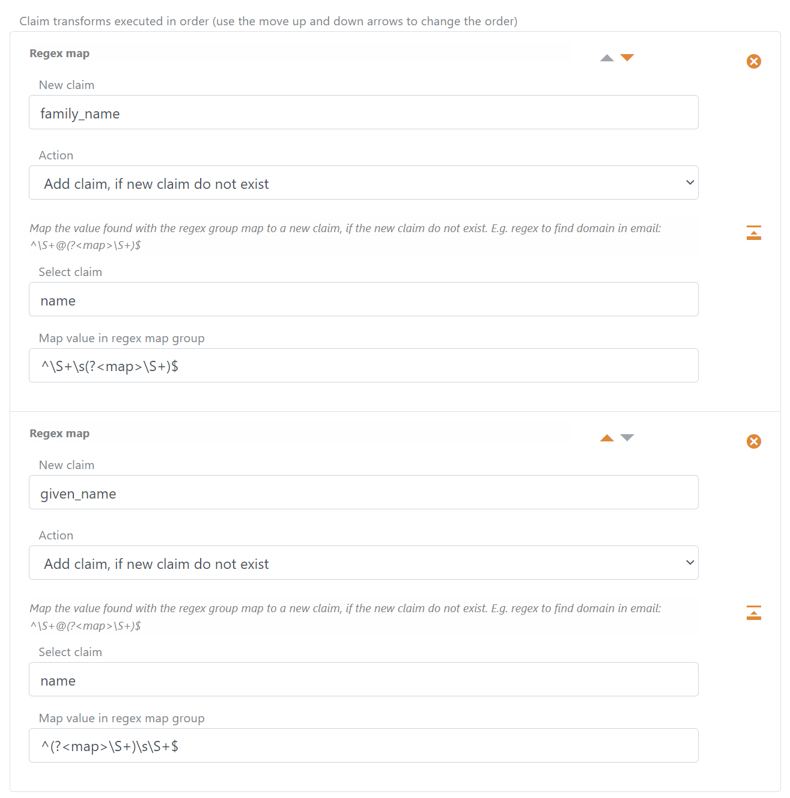

# Claim transform

Each FoxIDs up-party and down-party support configuring claim transforms. This means that two sets of claim transforms can be executed on each user authentication.

Please see [claim transform examples](#claim-transform-examples)

> Enable `Log claim trace` in the [log settings](logging.md#log-settings) to see the claims before and after transformation in [logs](logging.md). 

Claim transforms can e.g., be configured in a login up-party.

And likewise claim transforms can e.g., be configured in a OpenID Connect down-party.

> Claims are by default represented as JWT claims. If the up-party or down-party is SAML 2.0 the claims is represented as SAML 2.0 claims.

A claim transform will do one of op to five different actions depending on the particular claim transform type.

Claim transform actions:

- `Add` - add a new claim
- `Replace` - add a new claim and remove existing claims if one or mere exist
- `Add if not` - do the add action if the condition does not match
- `Replace if not` - do the replace action if the condition does not match
- `Remove` - remove the claims if one or mere exist

The claim transforms is executed in order and the actions is therefore executed in order. This means that it e.g., is possible at one point in the sequence to remove a claim and later in the sequence to add the claim again.

Using the `Add if not` actions it is possible to add a claim if another claim or a claim with a value do not exist.

Claim transform types that support all actions:

- `Match claim` - do the action if the claim type match
- `Match claim and value` - do the action if the claim type and claim value match
- `Regex match` - do the action if the claim type match and claim value match the regular expression

Claim transform types that support `Add` and `Replace` actions:

- `Constant` - always do the action
- `Map` - do the action if the claim type match, then map the claim value to a new claim
- `Regex map` - do the action if the claim type match and claim value match the regular expression group, then map the group value to a new claim
- `Concatenate` - do the action if one or more of the claim types match, then concatenate the claim values to a new claim

## Claim transform examples

### Transform name to given_name and family_name

Transform the `name` claim approximately to the two claims `given_name` and `family_name`. 

The transformation will split the value in the `name` claim at the first occurring space and respectively add the `given_name` and `family_name` claims, if they do not already exist.  
If there are more than one space in the `name` claim value. New `given_name` and `family_name` claims will not be added because they already exist.

Use two `Regex map` claim transformations.

- Find the `family_name` claim value with regex `^\S+\s(?<map>\S+)$`
- Find the `given_name` claim value with regex `^(?<map>\S+)\s\S+$`

### Remove the default added up-party name from sub

The up-party name is default added to the `sub` claim ID value as a post name divided by a pipe e.g., `some-up-party|my-external-user-id`.

You can do a transform replace claim on the `sub` claim to remove the default added post value.

The transformation will split the value in the `sub` claim and replace the claim with a new `sub` only containing the original ID.

Use a `Regex map` claim transformation and select the `Replace claim` action.

- Find the ID without the default added post up-party name with regex `^(nemlogin\|)(?<map>.+)$`

You can do the same in a SAML 2.0 up-party using the `http://schemas.xmlsoap.org/ws/2005/05/identity/claims/nameidentifier` claim instead of the `sub` claim.