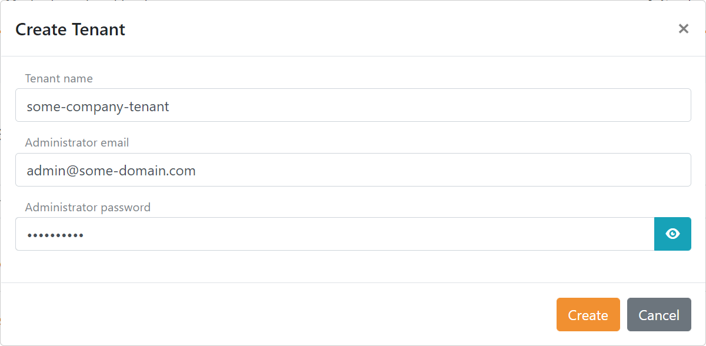
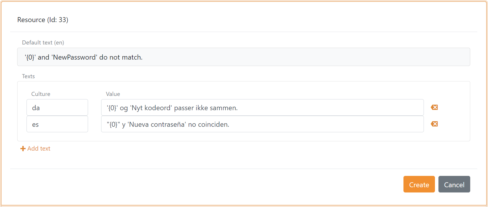
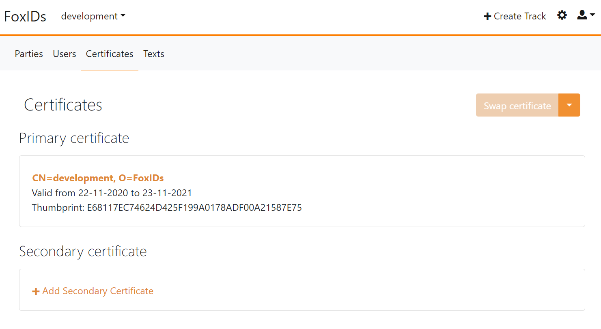
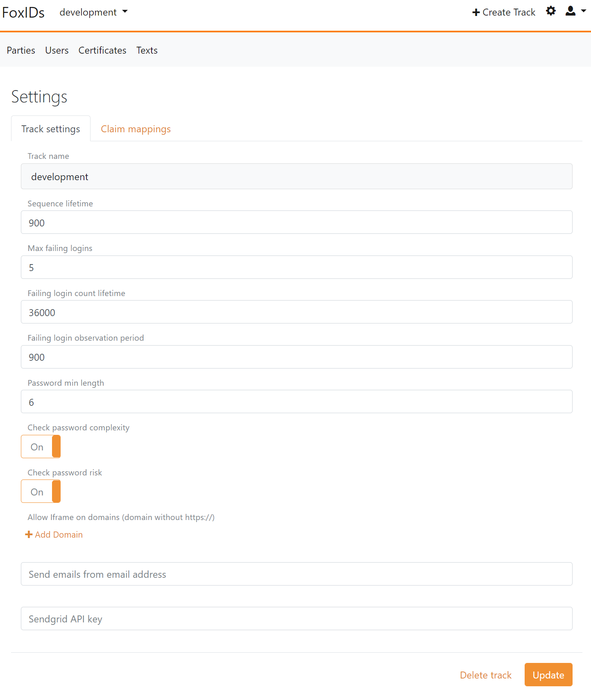
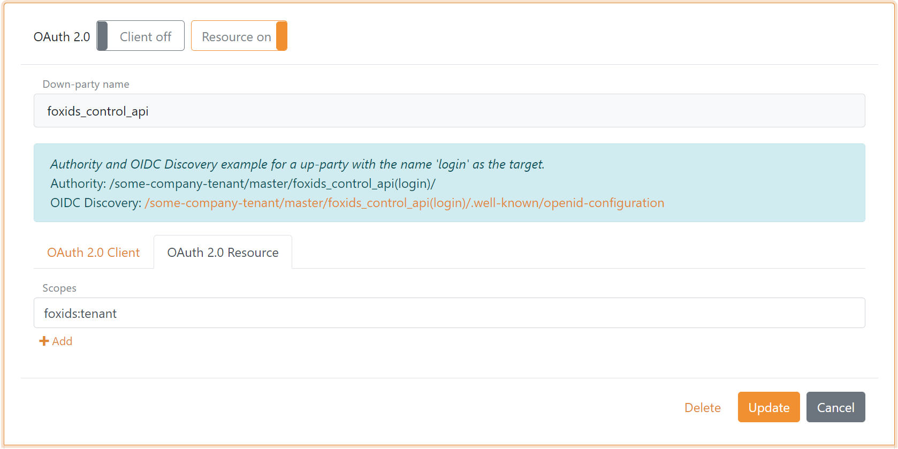

# FoxIDs Control
FoxIDs is configured with FoxIDs Control which consists of [FoxIDs Control Client](foxids-control-client) and [FoxIDs Control API](foxids-control-api). FoxIDs Control Client is secured by FoxIDs and use FoxIDs Control API to update the configuration. 

FoxIDs Control API contain all the configuration functionality. Therefore, it is possible to automate the configuration by integrating with FoxIDs Control API.

## FoxIDs Control Client 
FoxIDs Control Client is a Blazor WebAssembly web client.

### Tenant and master track
If FoxIDs is installed in your one Azure tenant you get access to the master tenant. You firstly need to create a tenant which will contain your entire security configuration. You probably only need one, but it is possible to configure an unlimited number of tenants.  

In the future, if you use FoxIDs at [https://FoxIDs.com](https://foxids.com) your one tenant will be pre created on registration.

A tenant contains a master track, from where the entire tenant it is configured. The master track contains a user repository and firstly only one administrator user.

Select and open the tenant you just created. At first the tenant only contains a master track, normally you should not change the master track configuration or add new up- parties or down-parties.  
It is possible to create more administrator user in the master track and add the administrator role claim `foxids_tenant_admin`.

FoxIDs support translating the interfaces elements into the languages that is configured. Default is English (FoxIDs Control Client only support English). It is possible to add text translations to all test elements.  
The text translations in the master track is used in all the other tracks. It is furthermore possible to add track specific translations to each track.

### Tracks
Configure more tracks, one for each of your environments e.g. dev, qa and prod.

> Create one or more tracks, do not place configuration in the master track.

A track contains a user repository and a default created up-party [login](login.md). It is possible to create users and add track specific text translations. 

Add [OAuth 2.0, OpenID Connect](oauth-2.0-oidc.md) and [SAML 2.0](saml-2.0.md) down-parties and down-parties.

Each track contains a primary certificate and possible a secondary certificate. It is possible to swap between the primary and secondary certificate if both is configured, depending on the [certificate](index.md#certificates) container type.

The track properties can be configured by clicking the top right setting icon. 

- Sequence lifetime is the max lifetime of a user login flow from start to end.
- FoxIDs protect against password guess. Configured in max failing logins, failing login count lifetime and observation period.
- Password requirements are configured regarding length, complexity and [password risk](https://haveibeenpwned.com/Passwords).
- It is possible to host the FoxIDs login interface in an iframe from a allowed domain.

## FoxIDs Control API
FoxIDs Control API is a REST API. The API expose a Swagger (OpenApi) interface document.

FoxIDs Control API can be called by an OAuth 2.0 client either acting as the client itself or as an authenticated user. FoxIDs Control API require the `foxids_tenant` scope if the client acts as itself. And the `foxids_tenant_user` scope if the client acts on-behalf of an authenticated user.

This shows the FoxIDs Control API configuration in the master track.

FoxIDs Control API is called with an access token as described in the OAuth 2.0 Bearer Token standard.

The Swagger (OpenApi) interface document is exposed on `.../swagger/v1/swagger.json`. 