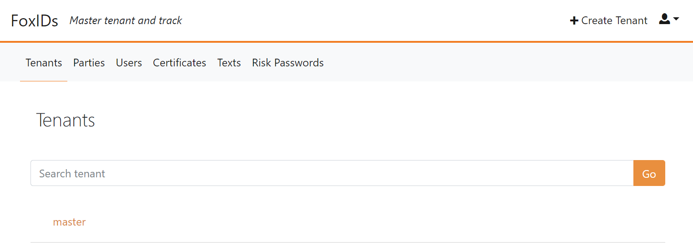

# Deployment

Deploy FoxIDs in your Azure tenant. 

The Azure deployment include:

- Two App Services one for FoxIDs and one for the FoxIDs Control (Client and API). Both App Services is hosted in the same App Service plan. 
- FoxIDs is deployed to the two App Services from the `master` branch with Kudu. Thereafter, it is possible to manually initiate the Kudu update.
- Key vault. Secrets are placed in Key vault.
- Cosmos DB.
- Redis cache.
- Application Insights.

### Send emails with Sendgrid
FoxIDs relay on Sendgrid to send emails to the users for account verification and reset password.  
You can optionally configure a Sendgrid from email and Sendgrid API Key in the Azure deployment configuration. You can either [create Sendgrid in Azure](https://docs.microsoft.com/en-us/azure/sendgrid-dotnet-how-to-send-email) or directly on [Sendgrid](https://Sendgrid.com), there are more free emails in a Azure manage Sendgrid.

> Remember to setup up [domain authentication](https://sendgrid.com/docs/ui/account-and-settings/how-to-set-up-domain-authentication/) in Sendgrid for the from email.

Sendgrid from email and API Key can at a later time be configure per track.

### First login and admin users
After successfully deployment open [FoxIDs Control Client](control.md#foxids-control-client) `https://foxidscontrolxxxxxxxxxx.azurewebsites.net` (the app service starting with foxidscontrol...) which brings you to the master tenant.  
The default admin user is: `admin@foxids.com` with password: `FirstAccess!`

> Create your one admin users with a valid email address and grant the users the admin role 'foxids:tenant.admin'.
>
> 

### Troubleshooting deployent errors

**Key Vault soft deleted**
If you have deleted a previous deployment the Key Vault is only soft deleted and sill exist with the same name for some months. 
In this case you can experience getting a 'ConflictError' with the error message 'Exist soft deleted vault with the same name.'.

The solution is to delete (purge) the old Key Vault, which will release the name.

## Seed

### Upload risk passwords

You can upload risk passwrods in FoxIDs Control Client master tenant on the Risk Passwords tap. 

Download the `SHA-1` pwned passwords `ordered by hash` from [haveibeenpwned.com/passwords](https://haveibeenpwned.com/Passwords).

> Be aware that it takes some time to upload all risk passwords. This step can be omitted and postponed to later.  
> The risk passwords are uploaded as bulk which has a higher consumption. Please make sure to adjust the Cosmos DB provisioned throughput (e.g. to 4000 RU/s) temporarily.

### Add sample configuration to a track

It is possible to run the sample applications after they are configured in a FoxIDs track. The sample configuration can be added with the [sample seed tool](samples.md#configure-samples-in-foxids-track).

## Customize domains

The FoxIDs and FoxIDs Control domain can be customized.  
//TODO – how to customize domains

> FoxIDs default endpoint `https://foxidsxxxx.azurewebsites.net` or custom a domain like e.g. `https://foxidsxxxx.com` or `https://foxids.xxxx.com`  
> FoxIDs Control default endpoint `https://foxidscontrolxxxx.azurewebsites.net` or custom a domain like e.g. `https://control.foxidsxxxx.com` or `https://foxidscontrol.xxxx.com`
