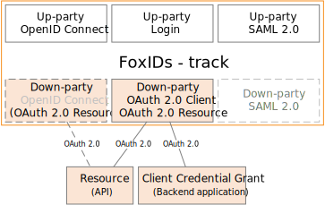

# Down-party - OAuth 2.0 

FoxIDs down-party [OAuth 2.0](https://datatracker.ietf.org/doc/html/rfc6749) enable you to connect an APIs as [OAuth 2.0 resources](#oauth-20-resource). And connect your backend service using [Client Credentials Grant](#client-credentials-grant).

## OAuth 2.0 Resource
An API is configured as a down-party OAuth 2.0 resource with a name and one or more scopes.

A client can subsequently be given access by configuring [resource and scopes](down-party-oidc.md#resource-and-scopes) in the client.

## Client Credentials Grant
An application using [Client Credentials Grant](https://datatracker.ietf.org/doc/html/rfc6749#section-4.4) could be a backend service secured by a client id and secret. PKCE is not validated in Client Credentials Grant.

- Specify client name in down-party name.
- Specify redirect URI.
- Select `token` as response type.
- Disable PKCE.
- Specify a secret.

Access tokens can be issued with a list of audiences and thereby be issued to multiple APIs defined in FoxIDs as OAuth 2.0 resources.  

## Resource Owner Password Credentials Grant
[Resource Owner Password Credentials Grant](https://datatracker.ietf.org/doc/html/rfc6749#section-4.3) is not supported for security reasons because it is insecure and should not be used.

## Client secrets
It is important to store client secrets securely, therefor client secrets are hashed with the same [hash algorithm](login.md#password-hash) as passwords. If the secret is more than 20 character (which it should be) the first 3 characters is saved as information and is shown for each secret in FoxIDs Control. 
