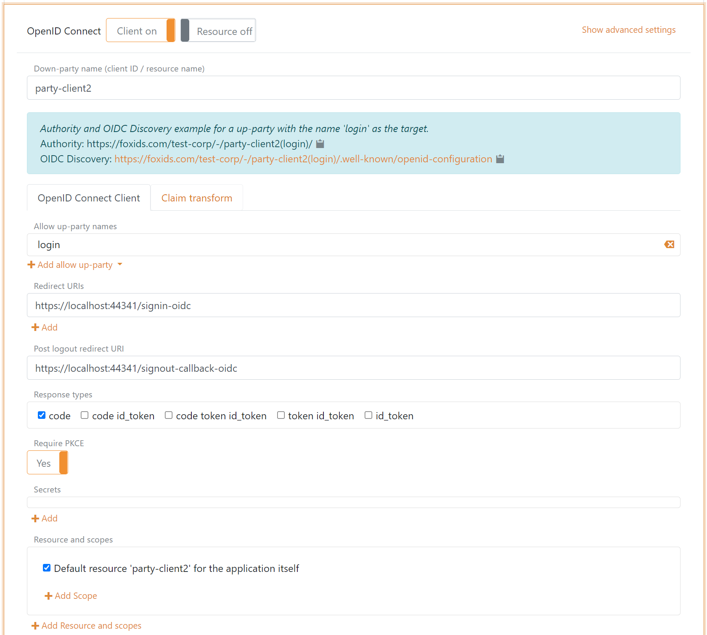
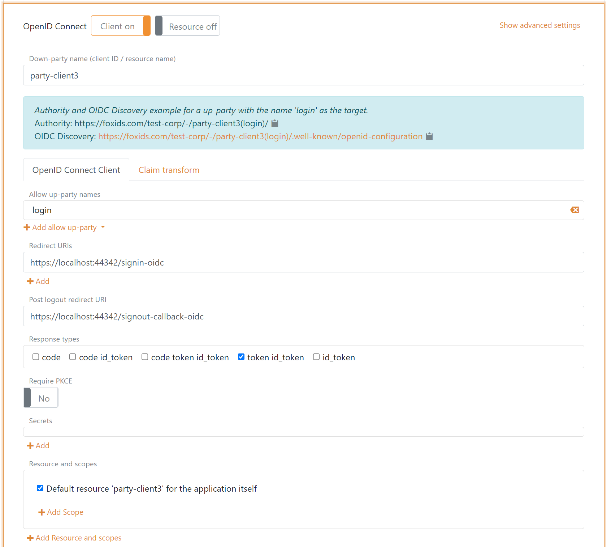
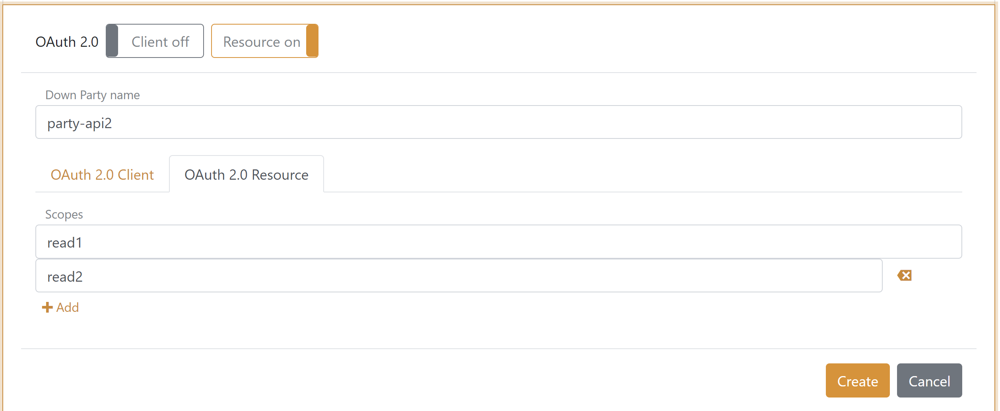

# OAuth 2.0 and OpenID Connect
OAuth 2.0, OpenID Connect, JWT and JWT claims are first class citizens in FoxIDs. Internally claims are always represented as JWT claims and request / response properties are described with OAuth 2.0 and OpenID Connect attributes. When FoxIDs converts between standards it also converts to the same internal representation using JWT claims and OAuth 2.0 / OpenID Connect attributes.

FoxIDs can act as an down-party [OpenID Provider (OP)](#openid-provider-op) authenticating the client using OpenID Connect. The client can request an access token for multiple API`s defined as [OAuth 2.0 resources](#oauth-20-resource).

FoxIDs support down-party [Client Credentials Grant](#client-credentials-grant) acting as an OAuth 2.0 resource owner. For security reasons [Resource Owner Password Credentials Grant](#resource-owner-password-credentials-grant) is not supported.

Future support:
- FoxIDs acting as an up-party OpenID Connect RP (client), authenticating with an external OP.
- *(Maybe support) FoxIDs acting as an up-party OAuth 2.0 client, authorizing with an external resource owner.*
- *(Maybe support) FoxIDs acting as an down-party OAuth 2.0 resource owner, supporting plain OAuth 2.0 client authorization.*

FoxIDs do not support plain OAuth 2.0 client authorization acting as an down-party OAuth 2.0 resource owner because it is less secure then using OpenID Connect.

## Down-party OpenID Provider (OP)
An application (RP) can be connected to FoxIDs with OpenID Connect where FoxIDs acts as a down-party OpenID Provider (OP).

FoxIDs support login and front channel logout (end session). A session is established when the user authenticates and the session id is included in the id token. The session is invalidated on logout, if the ID token is included in the logout request.

Default both id token and access token are issued with the client’s client id as the audience. The default resource can be removed from the access token in FoxIDs Control. 
Access tokens can be issued with a list of audiences and thereby be issued to multiple API`s defined in FoxIDs as OAuth 2.0 resources.  
The application can then call an API securing the call with the access token using the OAuth 2.0 Bearer Token standard.

FoxIDs support both client secret and PKCE. If a client is configured with both PKCE and secret(s) they will both (all) be validated. PKCE and client secret is not validated in implicit flow.  

There can be configured a maximum of 10 secrets per client.

FoxIDs support the UserInfo endpoint defined in the OpenID Connect standard.

### Configuration
The relaying party (RP) client (application) is configured in a FoxIDs track as an OpenID Connect down-party client.

> The clients FoxIDs discovery document is `https://foxids.com/tenant-x/track-y/party-client1/.well-known/openid-configuration`  
> if the client is located in tenant `tenant-x` and track `track-y` with the down-party client name `party-client1`  
> An up-party name e.g. `login` can possible be added to the discovery URL `https://foxids.com/tenant-x/track-y/party-client1(login)/.well-known/openid-configuration`

### Configure confidant client which use Authorization Code Flow
A confidant client could be a web application where the security is handled by the webserver which also stores the client secret.

- Specify client name in down-party name.
- Select allowed up-parties.
- Specify redirect URIs including both login and logout.
- Select `code` as response type or possible but not recemented `code token` or `code token id_token`.
- It is not required to use PKCE in a confidant client but recommended to mitigate replay attacks.
- Specify a secret.

### Configure public client which use Authorization Code Flow
This would be a browser-based riches client or mobile app. The application should use PKCE and not a client secret.

- Specify client name in down-party name.
- Select allowed up parties.
- Specify redirect URIs including both login and logout.
- Select `code` as response type.
- Use PKCE, default enabled.

### Configure public client which use Implicit Code Flow
This would be a web application where the security is handled by the webserver or a browser-based riches client. The application neither use PKCE or client secret.  
It is not recemented to use Implicit Code Flow because it is insecure.

- Specify client name in down-party name.
- Select allowed up parties.
- Specify redirect URIs including both login and logout.
- Select `token id_token` as response type or possible only `token`.
- Disable PKCE.
- Do not specify a secret.

### Client and API
It is possible to configure both client and API in the same OpenID Connect application configuration, where both the client and API is defined with the same name. Furthermore, it is possible to configure resource scopes for the API.

**Client tap**

**Resource tab**

### Resource and Scopes
An API is defined as a resource under which it is possible to define scopes. Such scopes is defined as the resource name dot scope e.g. `party-api1.read1` or `party-api1.read2`.

In the client configuration the scopes are defined underneath the resource.

In the resource configuration the scopes are defined as a list of scopes.

On scope configuration in the client it is validated if the scopes exist on the API. If the client and API is the same application configuration the scopes is automatically added to the resource.

### Scopes
The scopes can be configured in the client configuration. A scope can define a set of claims which should be issued.

A set of default scopes is added to the client configuration, which subsequently can be changed.

## OAuth 2.0 Resource
An API is configured as an OAuth 2.0 resource with a name and one or more scopes.

Access to the client can afterword`s be configured as [Resource and scopes](#resource-and-scopes) in a client.

## Client Credentials Grant
//TODO

Client id is required.

PKCE is not validated in Client Credentials Grant.

## Resource Owner Password Credentials Grant
Resource Owner Password Credentials Grant is not supported because it is insecure and should not be used.
