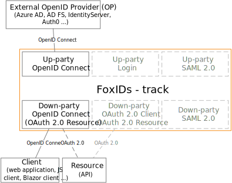

# OpenID Connect

FoxIDs support OpenID Connect as both up-party and down-party.

> It is recommended to use OpenID Connect Authorization Code flow with PKCE, because it is considered a secure flow.

## Up-party

Configure [up-party OpenID Connect](up-party-oidc.md) which trust an external OpenID Provider (OP).

How to guides:

- Connect two FoxIDs tracks in a tenant with a [track link](howto-tracklink-foxids.md)
- Connect two FoxIDs tracks in the same or different tenants with [OpenID connect](howto-oidc-foxids.md)
- Connect [Azure AD](up-party-howto-oidc-azure-ad.md) 
- Connect [Azure AD B2C](up-party-howto-oidc-azure-ad-b2c.md) 
- Connect [IdentityServer](up-party-howto-oidc-identityserver.md)
- Connect [Signicat](up-party-howto-oidc-signicat.md)
- Connect [Nets eID Broker](up-party-howto-oidc-nets-eid-broker.md)

## Down-party

Configure your application as a [down-party OpenID Connect](down-party-oidc.md).

Besides receiving an ID token the client can request an access token for multiple APIs defined as [down-party OAuth 2.0 resources](down-party-oauth-2.0.md#oauth-20-resource).  
An OAuth 2.0 resource can optionally be defined in a down-party OpenID Connect or a down-party OAuth 2.0.

