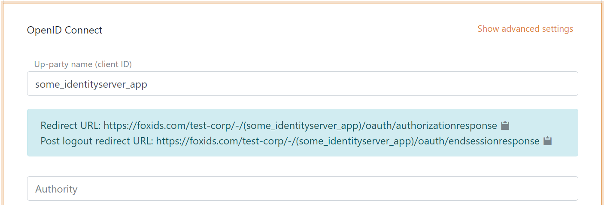

# Up-party - connect IdentityServer with OpenID Connect

FoxIDs can be connected to a IdentityServer with OpenID Connect and thereby authenticating an end user by trust to a IdentityServer client.

It is possible to connect a [IdentityServer client](#configure-identityserver-client) and read claims from the ID token or select a more complex case where claims is [read form the access token](#read-claims-from-access-token).

> The [sample](samples.md) `IdentityServerOidcOpSample` is configured in the FoxIDs test-corp track with the up-party name `identityserver_oidc_op_sample`. You can test login (username `alice` and password `alice`) by running the `IdentityServerOidcOpSample` and the `AspNetCoreOidcAuthorizationCodeSample` [samples](samples.md) and clicking `OIDC IdentityServer Log in` in the `AspNetCoreOidcAuthorizationCodeSample` application. The `IdentityServerOidcOpSample` sample is configured with Implicit Flow to enable local testing, please use Authorization Code Flow in production.

## Configure IdentityServer client

**1 - Start by creating an OpenID Connect up-party client in [FoxIDs Control](control.md)**

 1. Add the name

It is now possible to read the `Redirect URL` and `Post logout redirect URL`.

**2 - Then go to the IdentityServer configuration and create the client**

    yield return new Client
    {
        ClientId = "some_identityserver_app",

        AllowedGrantTypes = GrantTypes.Code,
        RequirePkce = true,
        ClientSecrets =
        {
            new Secret("BpCbINKwxELM ... eVpMClM84Rr0".Sha256())
        },

        AlwaysIncludeUserClaimsInIdToken = true,

        RedirectUris = { "https://foxids.com/test-corp/-/(some_identityserver_app)/oauth/authorizationresponse" },
        PostLogoutRedirectUris = { "https://foxids.com/test-corp/-/(some_identityserver_app)/oauth/endsessionresponse" },                

        AllowedScopes = new List<string>
        {
            IdentityServerConstants.StandardScopes.OpenId,
            IdentityServerConstants.StandardScopes.Profile,
            IdentityServerConstants.StandardScopes.Email,
        }
    };

*Code from the `IdentityServerOidcOpSample` [sample configuration]( https://github.com/ITfoxtec/FoxIDs.Samples/blob/master/src/IdentityServerOidcOpSample/Config.cs).*

**3 - Go back to the FoxIDs up-party client in [FoxIDs Control](control.md)**

 1. Add the IdentityServer's authority
 2. Add the profile and email scopes (possible other or more scopes)
 3. Add the IdentityServer client's client secret value as the client secret
 4. Select show advanced settings
 5. Select use claims from ID token
 6. Add the claims which will be transferred from the up-party to the down-parties. E.g., email, email_verified, name, given_name, family_name, role and possible the access_token claim to transfer the IdentityServer access token 
 7. Click create

That’s it, you are done. 

> The new up-party can now be selected as an allowed up-party in a down-party. 
> The down-party can read the claims from the up-party. It is possible to add the access_token claim to include the IdentityServer access token as a claim in the issued access token.

## Read claims from access token

If you want to read claims from the access token you need to add an API resource and API scope. And let the client use the new scope.

**1 - In the IdentityServer configuration**

    public IEnumerable<ApiResource> GetApiResources()
    {
        yield return new ApiResource("some.api", "Some API")
        {
            UserClaims = new[] { "email", "email_verified", "family_name", "given_name", "name", "role" },

            Scopes = new List<string>
            {
                "some.api.access"
            }
        };
    }

    public IEnumerable<ApiScope> GetApiScopes()
    {
        yield return new ApiScope("some.api.access", "Some API scope");
    }

You can remove the `AlwaysIncludeUserClaimsInIdToken = true` from the client.

*Code from the `IdentityServerOidcOpSample` [sample configuration]( https://github.com/ITfoxtec/FoxIDs.Samples/blob/master/src/IdentityServerOidcOpSample/Config.cs).*

**2 - Then go to [FoxIDs Control](control.md)**

1. Add the API scope `some.api.access` as a scope in the FoxIDs up-party client
2. Read claims from access token by not selecting to use claims from ID token

