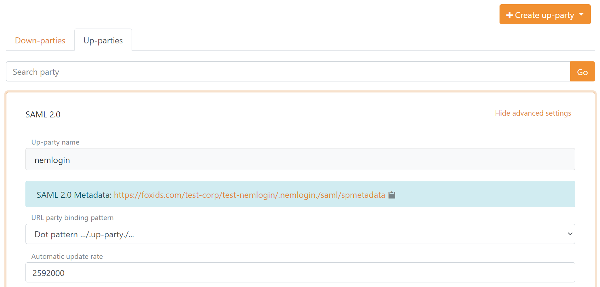
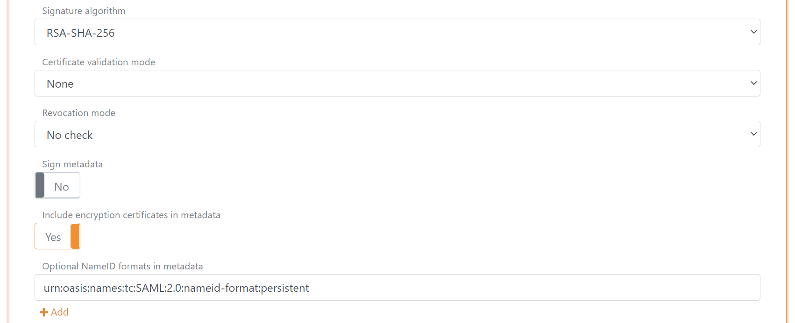
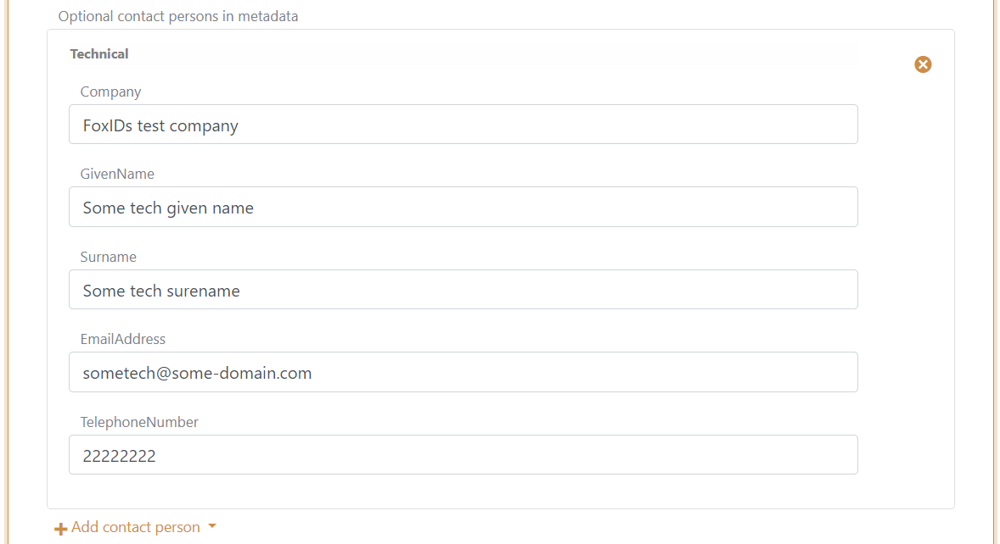
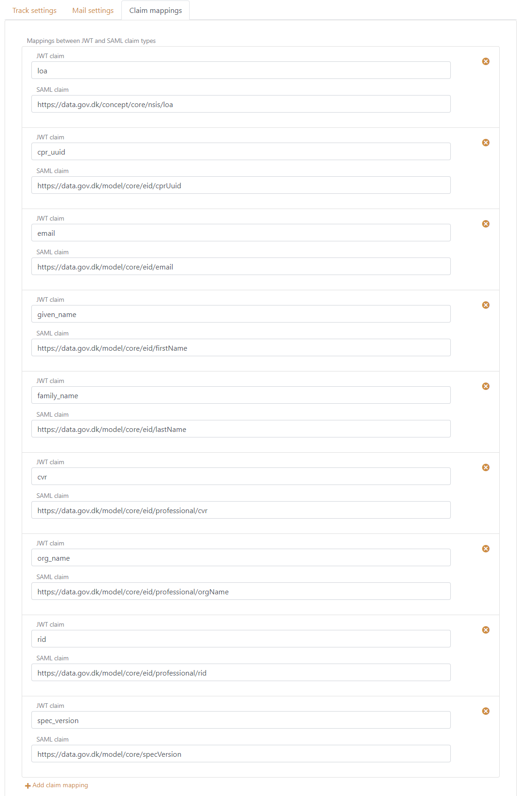

# Up-party - Connect NemLog-in3 (Danish IdP) with SAML 2.0

FoxIDs can be connected to NemLog-in3 with a [up-party SAML 2.0](up-party-saml-2.0.md). Where NemLog-in3 is a SAML 2.0 Identity Provider and FoxIDs is acting as an SAML 2.0 Relying Party (RP) / Service Provider (SP).

NemLog-in3 is a Danish Identity Provider (IdP) which uses the SAML 2.0 based OIOSAML 3. FoxIDs support NemLog-in3 / OIOSAML 3 including logging, issuer naming, required certificates and it is possible to support NSIS.

> NemLog-in3 beta test environment:  
>     - Guide https://www.nemlog-in.dk/vejledningertiltestmiljo  
>     - Create your service provider https://testportal.test-devtest4-nemlog-in.dk/TU  
>     - The administration https://administration.devtest4-nemlog-in.dk/  
>     - FOCES test certificate https://www.nemlog-in.dk/media/fvshwrp0/serviceprovider.p12, password: `Test1234`  
> NemLog-in3 test and production environment:  
>     - Test portal https://test-nemlog-in.dk/testportal/. Where you can find the NemLog-in3 IdP-metadata for test and production.

> A sample showing the NemLog-in3 integrations is configured in the FoxIDs `test-corp` with the up-party name `nemlogin_saml`. The configuration uses a separate track where the NemLog-in3 integrations is configured.  
> You can test NemLog-in3 login with the `AspNetCoreOidcAuthorizationCodeSample` [sample](samples.md#aspnetcoreoidcauthorizationcodesample) application by clicking `OIDC NemLog-in Log in`.

## Consider separate track

NemLog-in3 requires the Relying Party (RP) to use a OSES certificate and a high level of logging. Therefore, consider connecting NemLog-in3 in a separate track where the OCES certificate and log level can be configured without affecting any other configuration.

Two FoxIDs tracks can be connected with OpenID Connect. Please see the [connect FoxIDs with OpenID Connect](up-party-howto-oidc-foxids.md) guide. The track with a up-party connected to NemLog-in3 is called the parallel FoxIDs track in the guide.

Additional to the guide:

 - Remove the default created `login` up-party in the parallel track
 - Add the JWT claims mapped from SAML 2.0 claims to the OpenID Connect up-parties and down-parties

## Certificate

NemLog-in3 requires all requests (authn and logout) from the Relying Party (RP) to be signed. Furthermore, NemLog-in3 requires the RP to sign with a OCES certificate. It is not possible to use a certificate issued by another certificate authority, a self-signed certificate or a certificate issued by FoxIDs.

A OCES certificate is valid for three years where after it manually has to be updated.

FoxIDs require the certificate to be a `.PFX` file. Where a OCES certificate default is a `.P12` file. The OCES certificate can be converted from a `.P12` file to a `.PFX` file with the following [.NET code sample](https://github.com/ITfoxtec/FoxIDs/tree/master/tools/FoxIDs.ConvertCertificateTool). 

    var certificateFileName = "serviceprovider";
    var password = "Test1234";

    var certificate = new X509Certificate2($"{certificateFileName}.p12", password, X509KeyStorageFlags.Exportable | X509KeyStorageFlags.EphemeralKeySet);
    File.WriteAllBytes($"{certificateFileName}.pfx", certificate.Export(X509ContentType.Pfx, password));

The `.PFX` OCES certificate file is added as the primary certificate in the track.

It is subsequently possible to add a secondary certificate and to swap between the primary and secondary certificates.

## Configuring NemLog-in 3 as Identity Provider (IdP)

The following configuration description is made from at track called `test-nemlogin`. The required OCES certificate is pre-configured. 

> You need to [configure the OCES certificate](#certificate) before following this configuration.

**1 - Start by creating your service provider in NemLog-in3**

If you do not already have a service provider.

 1. Go to https://testportal.test-devtest4-nemlog-in.dk/TU
 2. Select if the service provider type should be public or private
 3. Create your service provider 

 **2 - Then create an IT system in NemLog-in3 for the FoxIDs up-party**

 1. Go to https://administration.devtest4-nemlog-in.dk/
 2. Select `IT system provider`
 3. Click `Add new IT system`
 4. Create the IT system
 5. Grant someone else or your self access 
 6. Login with the account you granted access (if you grant yourself access, then do logout and relogin to get access)
 7. Select `IT systems`
 8. Click on the IT system you just created
 9. Download the NemLog-in metadata. The metadata file is used to configure the FoxIDs SAML 2.0 up-party in the next step.

**3 - Then create an SAML 2.0 up-party in [FoxIDs Control Client](control.md#foxids-control-client)**

 1. Add the name
 2. Select show advanced settings
 3. Select the dot URL binding pattern
 4. Set the session lifetime to 1800 (30 minutes)

 5. Disable automatic update
 6. Click Read metadata from file and select the NemLog-in metadata

 7. Configure a custom SP issuer, the issuer is required to start with `https://saml.`
    - The issuer in this example `https://saml.foxids.com/test-corp/test-nemlogin/`
 8. Configure claims, the following claims is most often used:
    - `https://data.gov.dk/concept/core/nsis/loa`
    - `https://data.gov.dk/model/core/eid/cprUuid`
    - `https://data.gov.dk/model/core/eid/email`
    - `https://data.gov.dk/model/core/eid/firstName`
    - `https://data.gov.dk/model/core/eid/lastName`
    - `https://data.gov.dk/model/core/eid/professional/cvr`
    - `https://data.gov.dk/model/core/eid/professional/orgName`
    - `https://data.gov.dk/model/core/eid/professional/rid`
    - `https://data.gov.dk/model/core/specVersion`

 9. In production only! Set certificate validation mode to `Chain trust` and revocation mode to `Online`
 10. Select to include the encryption certificate in metadata
 11. Set the NameID format in metadata to `urn:oasis:names:tc:SAML:2.0:nameid-format:persistent`

 

 12. Add an attribute consuming service in metadata and add the service name.
 13. Add all the claims configured in step 8 as requested attributes with the format `urn:oasis:names:tc:SAML:2.0:attrname-format:uri`. Optionally set each attribute as required.

 14. Add at least one technical contact person
 

 15. Click create
 16. Re-open the SAML 2.0 up-party you just created
 17. Download the SAML 2.0 up-party metadata. The metadata file is used to configure the NemLog-in IT system.
 
 **4 - Then go to the IT system you created in NemLog-in3**

 1. Click upload metadata file and upload the SAML 2.0 up-party metadata file
 2. Click apply for integration test (two times)

 **5 - Add SAML 2.0 claim to JWT claim mappings in [FoxIDs Control Client](control.md#foxids-control-client)**

 FoxIDs internally converts SAML 2.0 clams to JWT claims. NemLog-in3 / OIOSAML 3 defines a set of SAML 2.0 claims where JWT mappings need to be added.

 1. Go to settings and claim mappings
 2. Add mappings for all the claims configured in step 3.8
 3. Click update

You are done. The SAML 2.0 up-party can now be used as an up-party for down-parties in the track.

> A down-party will only issue added claims.  
> Therefor, remember to add the JWT claims to OpenID Connect down-parties and SAML 2.0 claims to SAML 2.0 down-party.

## Logging

NemLog-in requires requests and responses to be logged including the signature proof. It is also required to log which identity have done login and logout of which session, at what time and the IP address.  
[FoxIDs default log](logging.md) errors and events including the time and the IP address.

It can be configured which logs should be logged to the Application Insights which is part of the FoxIDs installation or to an external repository with a [log stream](logging.md#log-stream).

The required log level is configured in the FoxIDs log settings:

 - Enable `log info trace`
 - Enable `log claims trace`
 - Enable `log message trace`

## Request authentication context

You can request a desired NSIS assurance level as an authn context class reference.

Possible NSIS assurance levels:
 - `https://data.gov.dk/concept/core/nsis/loa/Low`
 - `https://data.gov.dk/concept/core/nsis/loa/Substantial`
 - `https://data.gov.dk/concept/core/nsis/loa/High`

You can likewise specify ID type as an authn context class reference.

Possible ID types:
 - `https://data.gov.dk/eid/Person`
 - `https://data.gov.dk/eid/Professional`

And possible credential types:
 - `https://nemlogin.dk/internal/credential/type/nemidkeycard`
 - `https://nemlogin.dk/internal/credential/type/nemidkeyfile`
 - `https://nemlogin.dk/internal/credential/type/mitid`
 - `https://nemlogin.dk/internal/credential/type/local`
 - `https://nemlogin.dk/internal/credential/type/test`

In the case you need to provide different sets of authn context class references. You need to create multiple SAML 2.0 up-parties connected to NemLog-in as different IT systems.  
E.g., if you need to support step-up authentication. Then you would create one SAML 2.0 up-party with authn context class reference `https://data.gov.dk/concept/core/nsis/loa/Substantial` and another SAML 2.0 up-party with authn context class reference `https://data.gov.dk/concept/core/nsis/loa/High`.