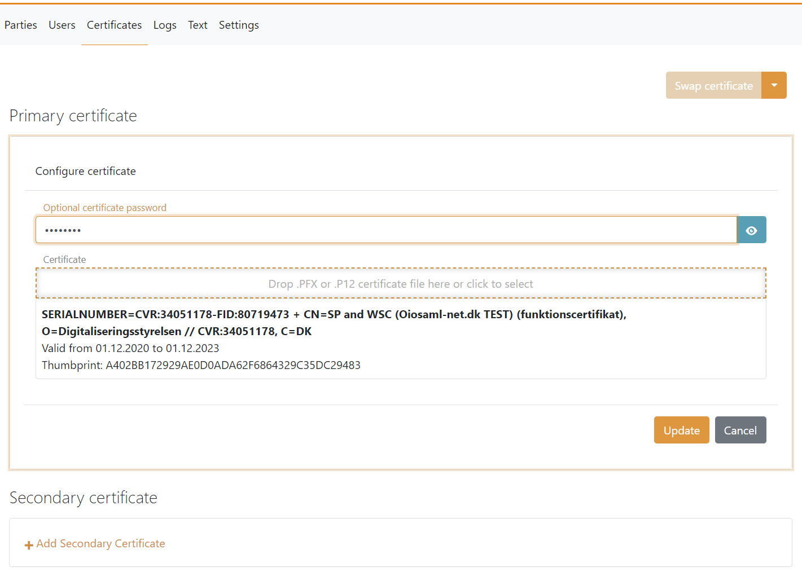

# Up-party - Connect NemLog-in3 (Danish IdP) with SAML 2.0

FoxIDs can be connected to NemLog-in3 with a [up-party SAML 2.0](up-party-saml-2.0.md). Where NemLog-in3 is a SAML 2.0 Identity Provider (IdP) and FoxIDs is acting as an SAML 2.0 Relying Party (RP).

NemLog-in3 is a Danish Identity Provider (IdP) which use the SAML 2.0 based OIOSAML 3. FoxIDs support NemLog-in3 including NSIS, logging, issuer naming and required certificates.

> NemLog-in3 beta test environment:  
> Guide https://www.nemlog-in.dk/vejledningertiltestmiljo  
> Create your service provider https://testportal.test-devtest4-nemlog-in.dk/TU  
> The administration https://administration.devtest4-nemlog-in.dk/
> FOCES test certificate https://www.nemlog-in.dk/media/fvshwrp0/serviceprovider.p12, password: Test1234

> NemLog-in3 test and production environment:  
> Test portal https://test-nemlog-in.dk/testportal/. Where you can find the NemLog-in3 IdP-metadata for test and production.

## Considder seperat track

NemLog-in3 requires the Relying Party (RP) to use a OSES certificate and a high level of logging. Therefore, consider connecting NemLog-in3 in a separate track where the OCES certificate and log level can be configured without affecting any other configuration.

Two FoxIDs tracks can be connected with OpenID Connect. Please see the [connect FoxIDs with OpenID Connect](up-party-howto-oidc-foxids.md) guide. The track with the up-party connected to NemLog-in3 is called the parallel FoxIDs track in the guide.

## Certificate

NemLog-in3 requires all requests (authn and logout) from the Relying Party (RP) to be signed. Furthermore, NemLog-in3 requires the RP to sign with a OCES certificate. It is not possible to use a certificate issued by another certificate authority, a self-signed certificate or a certificate issued by FoxIDs.

A OCES certificate is valid for three years where after it manually has to be updated.

FoxIDs require a .PFX certificate where a OCES certificate default is a .P12. The OCES certificate can be concerted from .P12 to .PFX with the following .NET code.

    var certificateFileName = "serviceprovider";
    var password = "Test1234";

    var certificate = new X509Certificate2($"{certificateFileName}.p12", password, X509KeyStorageFlags.Exportable | X509KeyStorageFlags.EphemeralKeySet);
    File.WriteAllBytes($"{certificateFileName}.pfx", certificate.Export(X509ContentType.Pfx, password));

The .PFX OCES certificate is added as the primary certificate in the track.

It is subsequently possible to add a secondary certificate and to at swap between the primary and secondary certificate.

## Configuring NemLog-in 3 as Identity Provider (IdP)

//TODO

## Logging

//TODO

## NSIS

//TODO