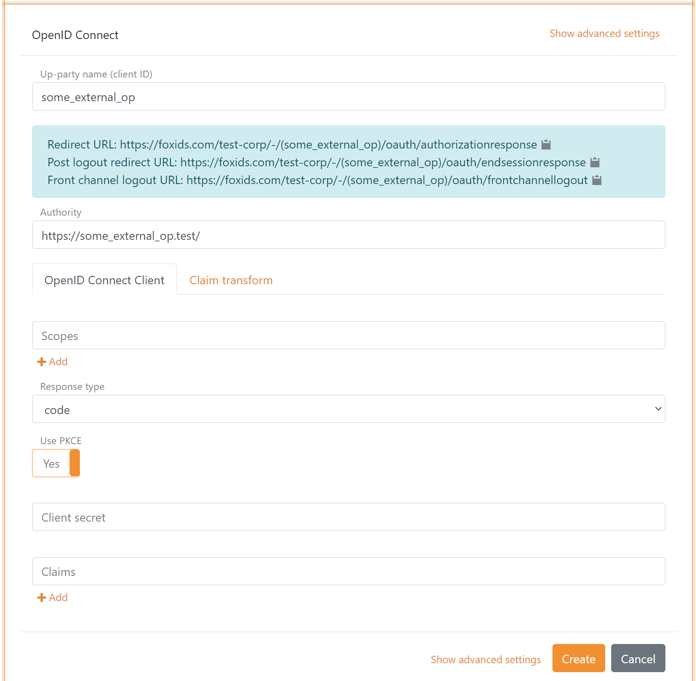

# Up-party - OpenID Connect

FoxIDs up-party [Relying Party (RP) / Client](#relying-party-rp-cient) which trust an external OpenID Provider (OP) / Identity Provider (IdP) using OpenID Connect.

How to guides:

- Connect [Azure AD](up-party-howto-oidc-azure-ad.md) 
- Connect [IdentityServer](up-party-howto-oidc-identityserver.md)

## Relying Party (RP) / Client
An external OpenID Provider (OP) can be connected to a FoxIDs up-party Relying Party (RP) / Client with OpenID Connect.

The following screen shot show all the FoxIDs up-party configuration available in [FoxIDs Control](control.md).

The external OP is configured as an authority. FoxIDs automatically calls the OpenID Configuration endpoint (`.well-known/openid-configuration`) on save. You can see the added configuration by opening the up-party again.

FoxIDs automatically read future updates. If the endpoint become unavailable for a period of time FoxIDs will stop the automated update process. It can be restarted by updating the up-party in FoxIDs Control Client or API.

> FoxIDs Control Client only support creating automatic updated up-parties using the OpenID Configuration endpoint. FoxIDs Control API support both automatic and manually updated up-parties. In manual you can specify all values and the OpenID Configuration endpoint (`.well-known/openid-configuration`) will not be called.

Default the up-party is configured for Authorization Code Flow, to use PKCE and read claim from the external access token. These settings can be changed.

The scopes the FoxIDs up-party should send in the request to the external OP can be configured. E.g, profile or email.

The up-party only transfer default claims and configured claim to the down-partis. 

Default transferred claims: sub, sid, acr and amr

FoxIDs default use the brackets party pattern `.../(up-party)/...`. If not supported by the external OP (e.g., like Azure AD), the pattern can be changed to the tildes party pattern `.../~up-party~/...`.

If necessary, a custom client ID can be configured, otherwise the up-party name is used as the client ID.

Optionally the issuer otherwise read from the OpenID Configuration endpoint can be changed. Furthermore, multiple issuers can be configured to trust tokens form multiple issuers signed with the same key.
