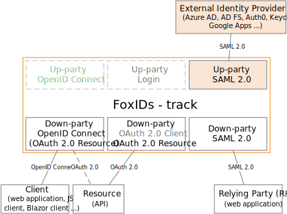
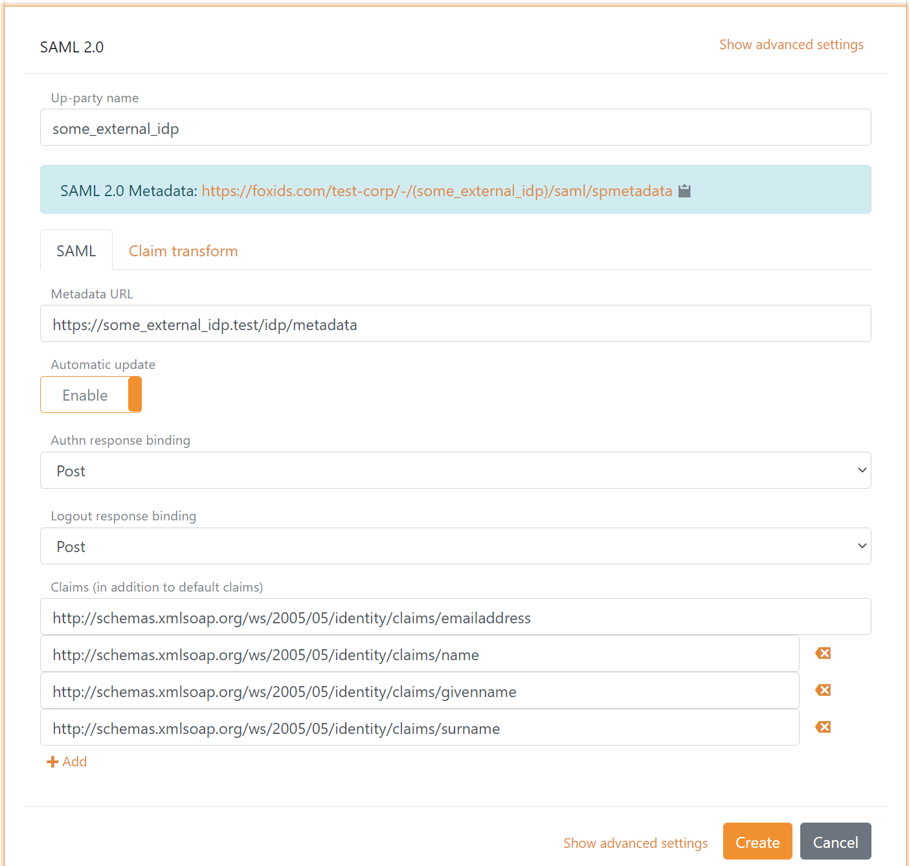

# Up-party - SAML 2.0

FoxIDs up-party [SAML 2.0](https://docs.oasis-open.org/security/saml/v2.0/saml-core-2.0-os.pdf) which trust an external SAML 2.0 Identity Provider (IdP).

It is possible to configure multiple SAML 2.0 up-parties which then can be selected by [down-parties](parties.md#down-party).

FoxIDs support [SAMl 2.0 redirect and post bindings](https://docs.oasis-open.org/security/saml/v2.0/saml-bindings-2.0-os.pdf).

A up-party expose [SAML 2.0 metadata](https://docs.oasis-open.org/security/saml/v2.0/saml-metadata-2.0-os.pdf) and can be configured with SAML 2.0 metadata or by manually adding the configuration details.

Both the login, logout and single logout [SAML 2.0 profiles](https://docs.oasis-open.org/security/saml/v2.0/saml-profiles-2.0-os.pdf) are supported. The Artifact profile is not supported.

> The FoxIDs SAML 2.0 metadata do only include logout and single logout information if logout is configured in the SAML 2.0 up-party.

How to guides:

- Connect [AD FS](up-party-howto-saml-2.0-adfs.md)
- Connect [PingIdentity / PingOne](up-party-howto-saml-2.0-pingone.md)
- Connect [NemLog-in (Danish IdP)](up-party-howto-saml-2.0-nemlogin.md)
- Connect [Context Handler (Danish IdP)](howto-saml-2.0-context-handler.md#up-party---connect-to-context-handler)

## Configuration
How to configure an external SAML 2.0 Identity Provider (IdP).

> The FoxIDs up-party SAML 2.0 metadata endpoint is `https://foxids.com/tenant-x/track-y/(some_external_idp)/saml/spmetadata`  
> if the IdP is configured in tenant `tenant-x` and track `track-y` with the up-party name `some_external_idp`  

The following screen shot show the basic FoxIDs up-party SAML 2.0 configuration available in [FoxIDs Control Client](control.md#foxids-control-client).
Where the configuration is created with the external IdP metadata.

> More configuration options become available by clicking `Show advanced settings`.

Manual configuration become available by disabling `Automatic update`.

> Change the issued SAML 2.0 claim collection with [claim transforms](claim-transform.md).